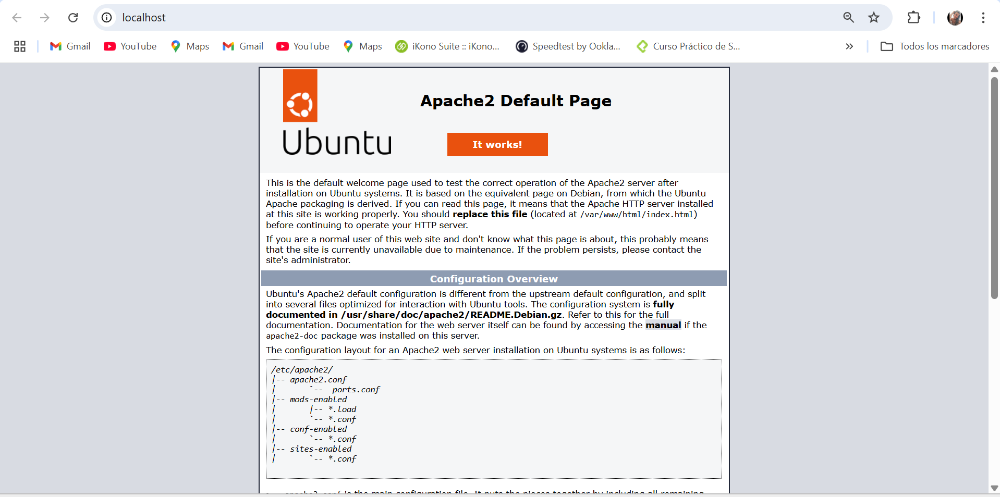
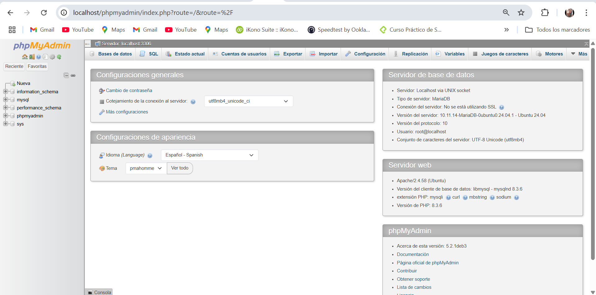

# LAMP LAB - Integración Tecnológica

## 1. ¿Qué es Apache?

Apache es un servidor web de código abierto que permite alojar y mostrar páginas web en un navegador. 
Funciona recibiendo solicitudes HTTP de los clientes (navegadores) y respondiendo con contenido como 
HTML, imágenes o archivos PHP procesados.

Es uno de los servidores web más utilizados en el mundo.

---

## 2. ¿Qué es LAMP?

LAMP es un conjunto de tecnologías usadas para desarrollar aplicaciones web.

Significa:

- Linux → Sistema operativo
- Apache → Servidor web
- MySQL → Sistema de gestión de bases de datos
- PHP → Lenguaje de programación del lado del servidor

Estas tecnologías trabajan juntas para crear aplicaciones web dinámicas.

---

## 3. Diferencia entre Apache y NGINX

| Apache | NGINX |
|--------|--------|
| Modelo basado en procesos | Modelo basado en eventos |
| Más configurable con .htaccess | Mayor rendimiento con alto tráfico |
| Muy usado en hosting tradicional | Más eficiente en servidores modernos |

Apache es más flexible.
NGINX es más rápido en alto rendimiento.

---

## 4. Evidencias

### Localhost funcionando

### PHP funcionando (phpinfo)

### PhpMyAdmin funcionando

